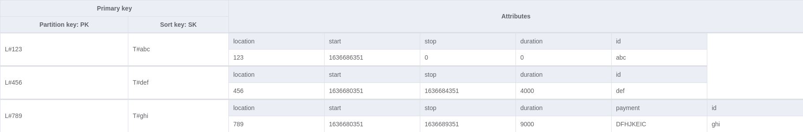
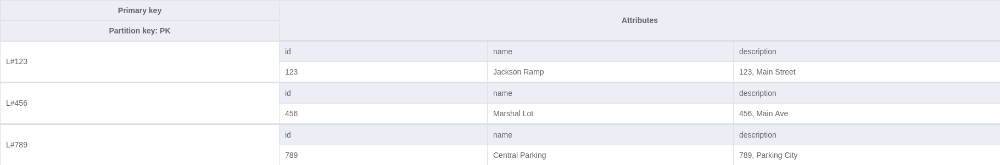
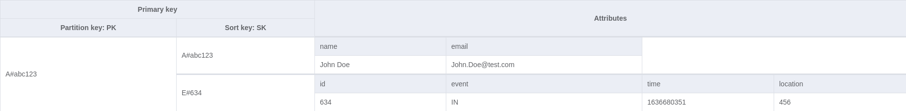

# ParkingBooth

ParkingBooth is a fully serverless automated API to handle a parking garage with generated tickets and existing accounts.

### TODO
- [ ] sentinel errors for services
- [ ] sentinel errors for repositories
- [ ] check location existence for account events
- [ ] add per location access for accounts
- [ ] create location management endpoints
- [ ] create account management endpoints
